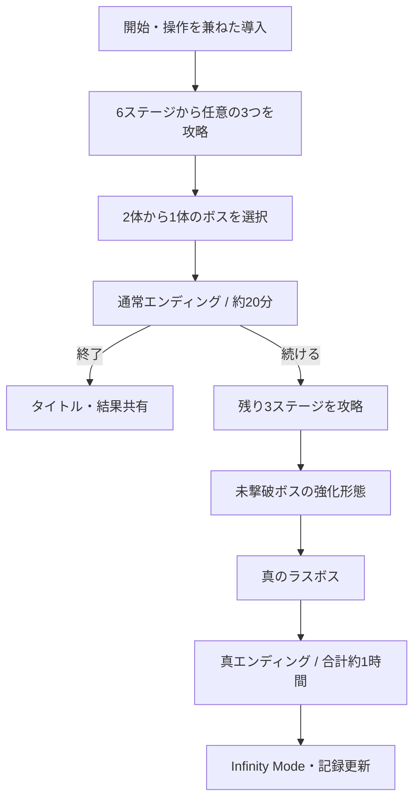

# CHARGE! クリッカー企画 GDD

> ステータス: キャンペーン全ルート実装済み・人間プレイテスト待ち
> 更新日: 2026-08-03
> 仮題: **PROJECT CHARGE**（正式名称は縦切り版の完成後に決定）  
> 対象: AI Browser Game Jam 4 / Godot 4.6 / Web  
> アート制作: PixelLabを中心としたオリジナルのピクセルアート

## 1. 企画概要

6つの回路を充電・強化し、蓄えたエネルギーを最適なタイミングで放電する、約20分で通常クリアできるアクティブ・クリッカーゲーム。

プレイヤーは6種類のステージから好きな3つを攻略し、相性の異なる2体のボスから1体を選んで倒す。ここで通常エンディングを迎え、短時間でも満足して終了できる。さらに遊びたいプレイヤーは、残りの3ステージと未撃破ボスを攻略し、すべての仕組みを要求する真のラスボスへ進む。

目標は「審査員が20分で満足でき、気に入った人は約1時間遊び続けられる」二層構造である。

## 2. プレイヤーに約束する体験

- クリックするたび、光・音・数字・画面振動で確かな手応えが返る。
- ただ連打するだけではなく、「今放電するか、限界まで充電するか」を常に判断する。
- どの3ステージを先に選ぶかでビルドとボス攻略が変わる。
- 通常エンディングだけでも一本のゲームとして完結する。
- 続行すると、それまでの選択を活用する真ルートが自然に開く。
- 手動操作、放置・自動化、連鎖、危険な過充電のいずれも勝てる。

## 3. デザインの柱

### 3.1 30秒で気持ちよい

最初のクリックからエネルギーが溜まり、セルが満ち、放電が起きる。説明を読まなくても「押す・溜まる・放つ」が理解できることを最優先する。

### 3.2 20分で完結する

通常ルートは寄り道ではなく、ボス戦・結果画面・スタッフロールを備えた完全なエンディングとする。「本当の結末を見るには続けてください」と強要しない。

### 3.3 選択がビルドになる

ステージの選択順、アップグレード、放電タイミングが互いに影響する。単純に数値が大きい項目を買うだけのゲームにはしない。

### 3.4 もう一周ではなく、その先へ進む

真ルートではリセットしない。同じセーブ・同じビルドのまま、残りの仕組みを取得して完成形へ向かう。

## 4. ゲーム全体の構成



### 4.1 想定プレイ時間

| 区間 | 初回の目標時間 |
|---|---:|
| 導入 | 2〜3分 |
| 任意の3ステージ | 9〜12分 |
| 最初のボス | 5〜7分 |
| 通常エンディング到達 | 18〜25分 |
| 残り3ステージ | 12〜18分 |
| 強化ボス | 6〜8分 |
| 真のラスボス | 8〜12分 |
| 真エンディング到達 | 50〜70分 |

効率化を理解したプレイヤーの目標は、通常クリア12〜16分、真クリア30〜40分とする。

## 5. コアループ

1. 入力して6つのエネルギーセルへ **CHARGE** する。
2. セルが満ちるほど倍率・熱・危険度が上がる。
3. 安全な部分放電か、6セルを揃えた大放電かを選ぶ。
4. 放電で敵・障害・ステージ目標へダメージを与え、資源を得る。
5. 資源を恒久アップグレード、ルール変更、アクティブ能力へ投資する。
6. 新しいステージを選択し、ビルドへ新しい仕組みを組み込む。

### 5.1 基本操作

| 操作 | マウス・タッチ | キーボード | ゲームパッド |
|---|---|---|---|
| CHARGE | クリック / 長押し | Space | A / Cross |
| DISCHARGE | 専用ボタン | Enter または X | X / Square |
| アクティブ能力 | 能力アイコン | 1〜3 | Shoulder / Face buttons |
| AUTO切替 | トグル | A | Y / Triangle |
| メニュー | UI | Esc | Menu / Options |

最終的な割り当てはゲームパッド設定画面で変更可能にする。

### 5.2 6つのセル

- 1〜5セルで放電すると、確実だが倍率は控えめな部分放電になる。
- 6セルが満ちると、短い演出停止を挟んで超放電を選べる。
- 満充電を維持すると過充電メーターと熱が上がり、出力も上がる。
- 限界を越えるとメルトダウンし、蓄積エネルギーの一部を失う。
- プレイヤーは毎回「今の確実な利益」と「次の大きな利益」を比較する。

## 6. 6つのステージ

総数は6、通常ルートの解放条件は3クリアで固定する。3ステージしか用意しない案は、前半と後半が対称になる美しさ、選択の幅、テーマを象徴する“6”を失うため採用しない。

| # | ステージ | 主な仕組み | 得意になるビルド | プレイ上の問い |
|---:|---|---|---|---|
| 1 | GENERATOR CORE | 手動入力・クリティカル | 手動連打 | 正確な入力でどこまで出力を上げるか |
| 2 | CAPACITOR VAULT | 容量・大放電 | 蓄積バースト | 小さく回すか、一撃を育てるか |
| 3 | THERMAL PLANT | 熱・冷却・過充電 | リスク型 | 限界直前を維持できるか |
| 4 | RELAY NETWORK | 連鎖・コンボ | チェイン型 | どのセルから連鎖させるか |
| 5 | DRONE ARRAY | 自動化 | 放置・自動型 | 手動と自動をどう共存させるか |
| 6 | SURGE LAB | 乱数・クリティカル・再抽選 | 幸運型 | 安定を捨てて上振れを狙うか |

各ステージは背景を変えるだけではなく、1つの新ルール、1つの専用アップグレード群、1つの短いクライマックスを持つ。

## 7. ボス

### 7.1 GRID LEECH

蓄積したエネルギーを定期的に吸収する。短い間隔の放電、手動入力、吸収予告への反応が有効。

- 予告線の後、最も充電されたセルから吸収する。
- 攻撃を中断させるには一定量を一度に放電する。
- 強化形態では複数セルを接続し、連鎖的に吸収する。

### 7.2 THERMAL TITAN

周囲の熱を押し上げ、過充電事故を誘う。冷却、安定性、自動化による一定出力が有効。

- 周期的に冷却効率を下げる。
- 高熱時だけ露出する弱点を持つ。
- 強化形態では安全域そのものが移動する。

### 7.3 相性設計の原則

相性は有利・不利を作るが、特定ビルドを詰ませない。どの3ステージの組み合わせでも両ボスを倒せることを自動テストと手動プレイで確認する。

## 8. 通常エンディング

最初のボス撃破後、次を必ず提供する。

- 完結した短いエンディング演出
- スタッフロール
- クリア時間、取得した回路、ビルド傾向、最大放電、最大過充電の結果
- 「タイトルへ」「真ルートを続ける」「結果をコピー」の選択肢

通常エンドを見た時点で、itch.ioの審査プレイとして満足できる品質を完成条件とする。

## 9. 真ルート

- 通常クリア時のセーブ、資源、アップグレードをそのまま使用する。
- 残り3ステージには、通常ルートで獲得した能力を使える追加目標を置く。
- 未撃破ボスは強化形態となり、新しい攻撃と特殊フェーズを持つ。
- 6ステージと2ボスをすべて倒すと、真のラスボス **CHARGE SINGULARITY** が出現する。

### 9.1 CHARGE SINGULARITY

全6システムの理解を確認する3フェーズ戦。

1. 手動入力、容量、放電タイミングを試す。
2. 熱、連鎖、自動化を同時に乱す。
3. ランダムに回路ルールを反転し、完成したビルドの応用を求める。

撃破後は真エンディングと、任意の記録更新モードを解放する。

## 10. アップグレードとシナジー

### 10.1 基礎アップグレード

- クリック出力
- セル容量
- 自動充電速度
- 冷却速度
- 放電倍率
- クリティカル率と倍率

### 10.2 ルール変更アップグレード例

- 連鎖先のセルも少量充電する。
- 溢れたエネルギーを次のセルへ移す。
- メルトダウン時に一定量を保持する。
- 3セル同時放電でコンボを開始する。
- 手動入力後、短時間だけ自動充電を強化する。
- 6セル超放電後、数秒間は熱が増えない。
- 熱が高いほどクリティカル率が上がる。

### 10.3 成立させる4ビルド

1. 手動・クリティカル
2. 自動化・安定出力
3. 連鎖・コンボ
4. 過充電・高リスク高出力

単独型だけでなく、2系統を組み合わせたハイブリッドにも固有の強みを持たせる。

## 11. 失敗と再挑戦

- ボス敗北後は即座に再戦できる。
- 資源、アップグレード、ステージ進行を失わない。
- 敗因に応じて「冷却を増やす」「部分放電を使う」など1行の助言を出す。
- 難易度を下げてもエンディングや評価を制限しない。
- ボス開始時に自動保存し、ブラウザを閉じても再開できる。

## 12. 初回プレイのUX目標

| 経過時間 | プレイヤーが到達する状態 |
|---:|---|
| 5秒 | CHARGEすると数字とセルが増えると理解する |
| 30秒 | 最初のアップグレードを購入する |
| 2分 | 最初のルール変更を解放する |
| 5分 | 最初のステージをクリアする |
| 約15分 | ボスを解放する |
| 約20分 | 通常エンディングへ到達する |

長文チュートリアルは使わない。必要な瞬間に入力を促し、成功したら説明を消す。画面には常に「次に何が起きるか」を1つだけ表示する。

## 13. 画面一覧

1. タイトル
2. メイン充電画面
3. ステージマップ
4. アップグレード
5. ボス選択
6. ボス戦
7. 通常エンディング・結果
8. 真ルートマップ
9. 真エンディング・結果
10. Infinity Mode（時間が許す場合）
11. 設定・ゲームパッド設定

## 14. 技術要件

### 14.1 Godot構成

新作は既存ランチャー内の4番目のゲームとして実装を開始し、採用決定後にJam提出用の起動先へ昇格させる。

推奨配置:

```text
godot/
  games/
    charge_clicker/
      scenes/
      scripts/
      resources/
      ui/
      tests/
  assets/
    charge_clicker/
```

ゲーム内容をコードへ直書きせず、以下をResourceまたはデータ定義として分離する。

- `GameState`: 進行、資源、ビルド、現在の戦闘
- `StageDefinition`: 解放条件、固有ルール、報酬
- `UpgradeDefinition`: 効果、前提、価格曲線、タグ
- `BossDefinition`: フェーズ、攻撃、相性補正
- `SaveManager`: バージョン付き保存と移行
- `AudioManager`: BGM、SE、ダッキング
- `InputManager`: キーボード、ゲームパッド、タッチ、再割り当て

### 14.2 保存

購入、ステージクリア、ボス開始・撃破、エンディング、設定変更で自動保存する。ブラウザを閉じた後も真ルートを再開できることをWebビルドで検証する。

### 14.3 対応環境

- Chrome / Safari / FirefoxのWebビルド
- マウス、キーボード、Xbox系・PlayStation系ゲームパッド、タッチ
- 日本語 / 英語
- BGM、SE、画面揺れ、フラッシュ、AUTO、言語、ゲームパッド設定

## 15. PixelLabアート方針

大量生成の前に、ヒーローとなるリアクター1点を作り、Godotの実寸表示で品質を確定する。

### 15.1 最初に固定するスタイルガイド

- 基準サイズ: 32pxまたは48px（縦切り版で比較して決定）
- 輪郭線の太さと色
- 1スプライトの最大色数
- 共通パレット
- 光源方向
- 投影法
- 密度・ディテール量
- 各アニメーションのフレーム数
- 背景透過と余白

### 15.2 必要アセット

- リアクター: 通常、充電、放電、メルトダウン
- 6ステージのアイコンと背景
- 通常ボス2体と各強化形態
- 真のラスボス3形態
- 6セル、メーター、アップグレードアイコン
- 火花、電撃、衝撃波、熱、クリティカルのVFX
- 通常・真エンディング用イラスト
- UI装飾

### 15.3 アニメーション目安

| 対象 | フレーム数 |
|---|---:|
| リアクター待機 | 4〜6 |
| 充電 | 6〜8 |
| 放電 | 6〜10 |
| ボス待機 | 4〜6 |
| ボス攻撃 | 6〜10 |
| 被弾 | 2〜4 |
| 撃破 | 10〜16 |

画像内へ文字を焼き込まず、テキストはGodot側で描画する。Nearestフィルター、整数倍表示、共通パレット、透過素材の分離を守り、生成後の手修正を前提にする。

## 16. 音と手触り

- クリック音は連続入力で音程が上がる。
- セル満充電時に固有音と一瞬の停止を入れる。
- 超放電は衝撃波、大きな数値、短い画面揺れ、BGMダッキングを組み合わせる。
- 過充電は青 → 黄 → 赤へ変化し、不安定な音とノイズを加える。
- ボスHP、予告、弱点状態は一目で判別できる。
- フィードバックを増やしても入力遅延と視認性を損なわない。

## 17. 完成条件

- 説明なしでもCHARGEとDISCHARGEを理解できる。
- 初見プレイヤーが18〜25分で通常ボスを倒せる。
- 通常エンディングだけで満足できる。
- 真ルートと真のラスボスを最後までクリアできる。
- 6ステージの遊びが明確に異なる。
- 4種類のビルドがいずれも成立する。
- 2ボスの攻略感が異なる。
- 真のラスボスが6システムをすべて試す。
- 自動テストで通常・真ルートを完走できる。
- 日本語・英語UIに欠けやはみ出しがない。
- Web保存、音声、ゲームパッドが実機で動く。
- 開始30秒以内に「気持ちいい瞬間」がある。

## 18. 今回は後回しにするもの

- 複雑なストーリーと大量の会話
- 20個以上の実績
- デイリーチャレンジ
- オンラインランキング
- オフライン進行
- 複数の追加モード
- Infinity Modeの作り込み

これらは通常ルート、真ルート、ピクセルアート統合、ブラウザ品質が完成した後にのみ検討する。

## 19. 未決事項

- 正式タイトル
- 世界観と主人公の存在形式
- 32px / 48pxの基準サイズ
- 縦画面寄りか横画面専用か
- AUTOの解放時期
- Infinity ModeをJam版へ含めるか

未決事項は、30秒プロトタイプと5分縦切り版を触ってから決める。企画段階の好みだけで固定しない。

## 20. 参考資料

- [AI Browser Game Jam 4](https://itch.io/jam/ai-jam-4)
- [PixelLab Documentation](https://www.pixellab.ai/docs)
- [PixelLab API Documentation](https://api.pixellab.ai/v2/docs)
